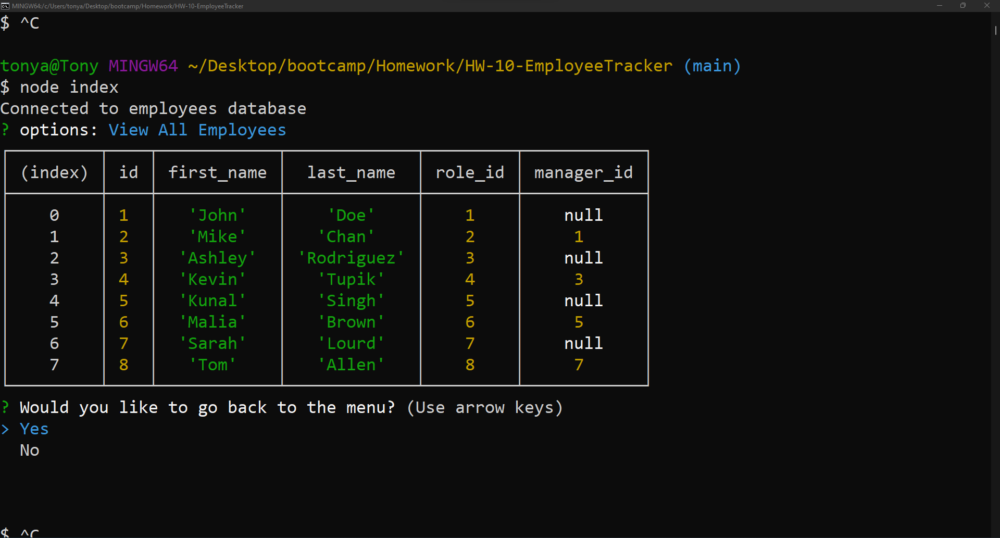
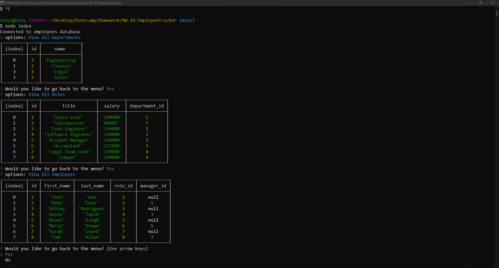

# CLI Employee Tracker
Track your employees, roles, and departments with mysql2!

## Table of Contents
- [Introduction](#introduction)
- [Application Preview](#application-preview)
- [Tech Stack](#tech-stack)
- [Installation](#installation)
- [Project Notes](#project-notes)

## Introduction
A mysql2 based CLI employee tracker made with NodeJs. Upon initialization, the user is prompted with a menu of questions pertaining to a mysql2 database- questions such as listing, adding, and deleting roles, etc. Query methods such as SELECT, DELETE, INSERT, and JOINS were used to achieve its functionaltiy as well as the most recent ES6 JavaScript syntax for asynchronous code- async/await, try/catch.

## Application Preview

## Tech Stack
Technologies used includes:
1. JavaScript (ES6)
2. Nodejs
3. MySql2
4. Inquirer

## Installation

## Project Notes
1. Need a better, more intuitive UI that makes the app more approachable and easier to read.

